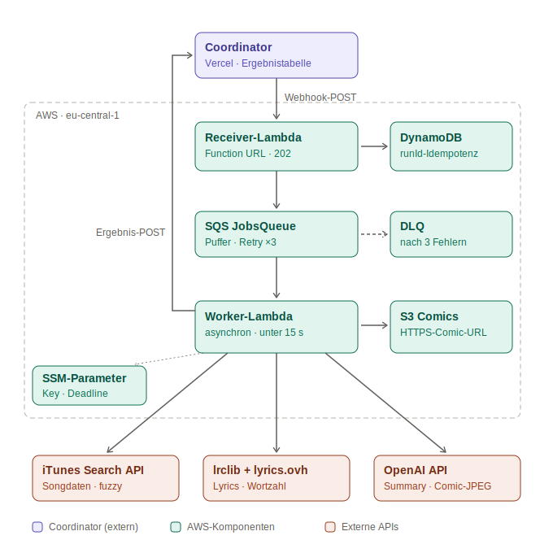

# song-worker

[](https://github.com/racon5555/Song-Cordinator/actions/workflows/ci.yml)

Asynchroner AWS-Worker (IBB-Praxisaufgabe): nimmt Song-Executions per Webhook
mit `202` an, verarbeitet sie entkoppelt über SQS und meldet das Ergebnis
(Songdaten, Word Count, Summary, Comic-URL) an den Coordinator zurück.



## Registrierung

```
Callback URL: https://dh4ouekm55kwgfhd2iymgc7maa0ofznd.lambda-url.eu-central-1.on.aws/
```

## Entwicklung

```
npm run typecheck · npm test · npm run synth · npm run deploy
```

## Konfiguration (SSM, ohne Redeploy)

- `/song-worker/ai-provider`: `stub` | `openai` | `anthropic`
- `/song-worker/openai-api-key`: SecureString
- `/song-worker/comic-deadline-ms`: Budget für KI-Comic (Default 13500), danach SVG-Fallback
